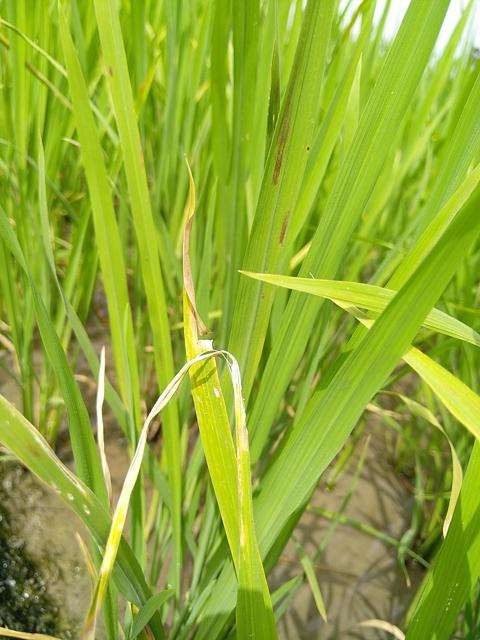
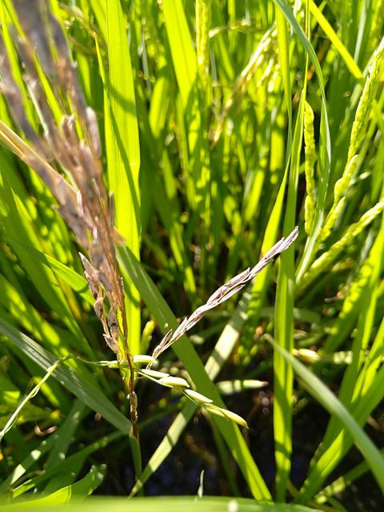
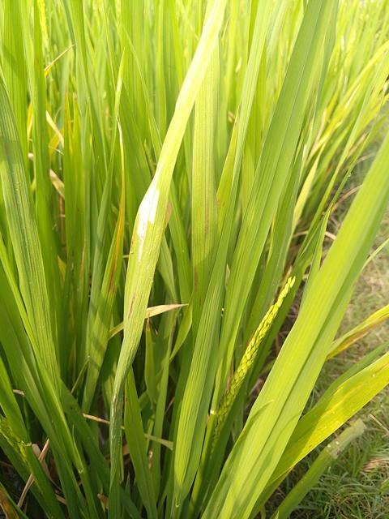
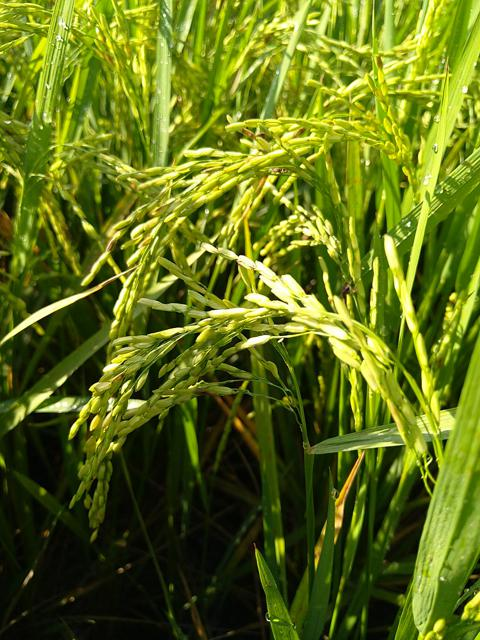
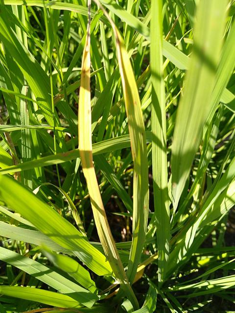

# Paddy Disease Classification

#### Image Classification project to compare the accuracy of different machine learning models

#### In this project we compare different types of machine learning models such as Neural Networks, K Nearest Neighbour, Random Forest, and Naive Bayes classifiers.

##### We compare 5 types of paddy diseases

- Blast
  
  
- Dead Heart

  
- Hispa

  
- Normal

  
- Tungro

  

##### In conclusion we identified that Neural Network model VGG16 is more accurate than other models
